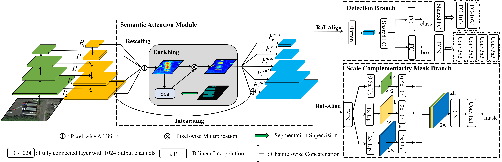

# SS-Net-for-Instance-Segmentation-in-RSI
This is the code for "Semantic Attention and Scale Complementary Network for Instance Segmentation in Remote Sensing Images"

This code is based on [MMDetction](https://github.com/open-mmlab/mmdetection)
